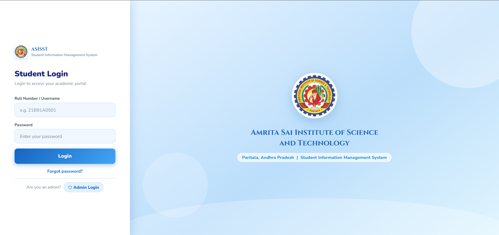
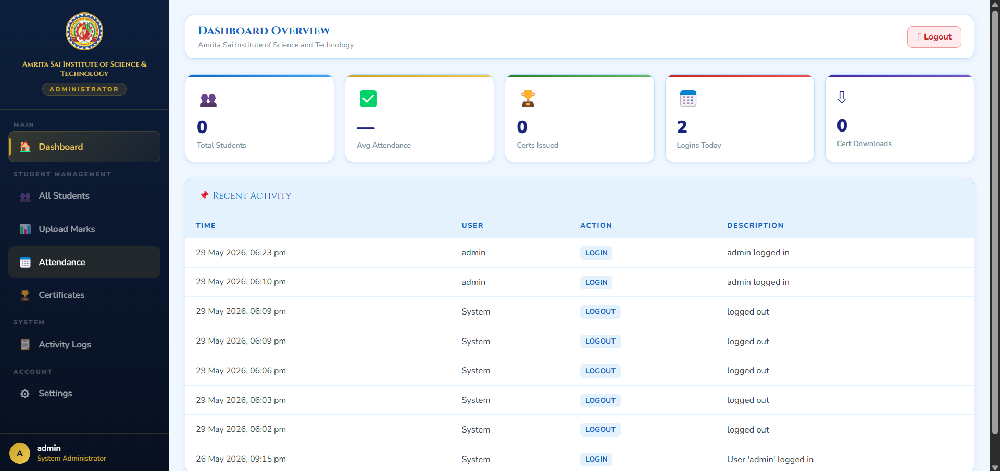
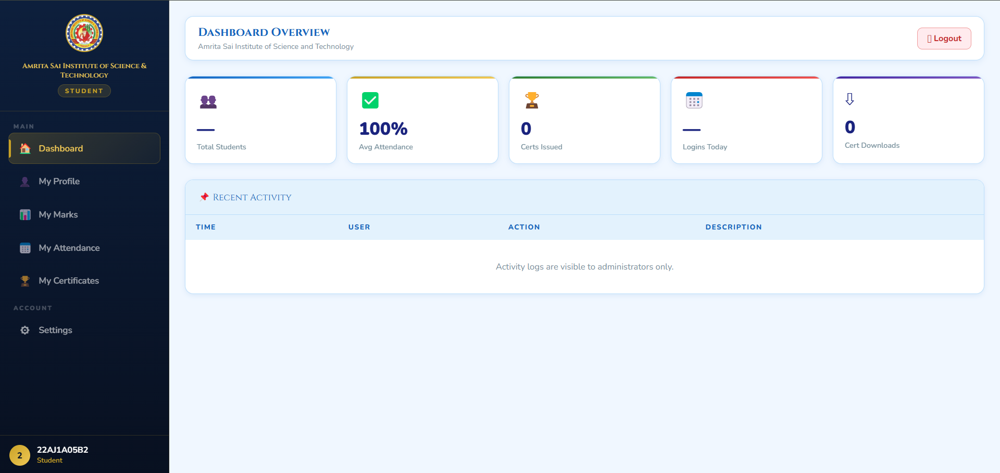
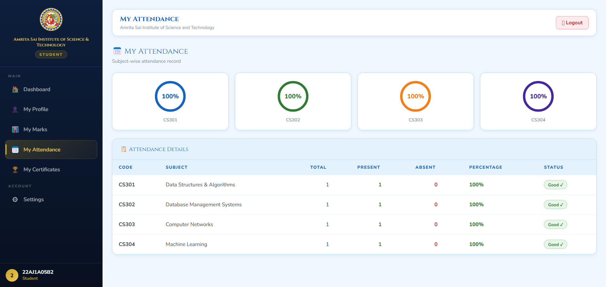
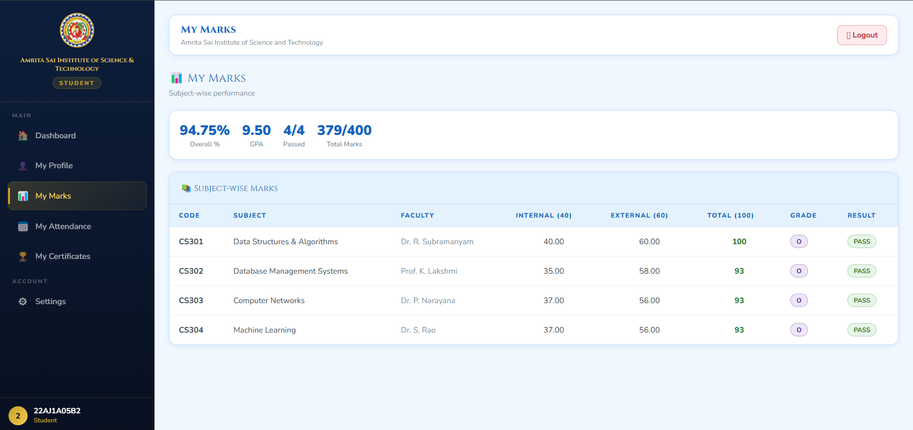

# 🎓 Student Information Management System

A full-stack **Student Information Management System (SIMS)** built using **Flask, MySQL, HTML, CSS, and JavaScript**. This application enables educational institutions to efficiently manage student records, academic performance, attendance, certificates, and user accounts through dedicated **Admin** and **Student** portals.

---

## 🚀 Features

### 👨‍💼 Admin Portal

* Add, update, search, and delete student records
* Manage student marks and attendance
* Upload and manage student certificates
* Reset student passwords
* View activity logs and dashboard statistics
* Filter students by branch and academic year
* Monitor overall student performance

### 👨‍🎓 Student Portal

* View personal profile information
* Check marks, grades, and GPA
* Monitor attendance percentage
* Download uploaded certificates
* Change account password
* Access academic records securely

### 🔒 Security Features

* Role-Based Access Control (RBAC)
* PBKDF2-SHA256 password hashing
* Secure session management
* Parameterized SQL queries to prevent SQL injection
* Password reset functionality
* Restricted PDF certificate uploads

---

## 🛠️ Tech Stack

### Backend

* Python
* Flask
* MySQL
* mysql-connector-python

### Frontend

* HTML5
* CSS3
* JavaScript (Vanilla JS)

### Database

* MySQL 8.0+

---

## 🎯 Key Concepts Demonstrated

* Full Stack Web Development
* REST API Development
* Authentication & Authorization
* Session Management
* Role-Based Access Control (RBAC)
* CRUD Operations
* Relational Database Design
* File Upload Management
* Password Hashing & Security
* Activity Logging & Auditing

---

## 📂 Project Structure

```text
Student-Information-Management-System/
│
├── app.py
├── database.py
├── config.py
├── create_admin.py
├── schema.sql
├── requirements.txt
│
├── templates/
│   └── index.html
│
├── static/
│   ├── css/
│   │   └── style.css
│   └── js/
│       └── main.js
│
└── uploads/
    └── certificates/
```

---

## 🏗️ System Architecture

```text
Frontend (HTML/CSS/JavaScript)
            │
            ▼
      Flask Backend
            │
            ▼
      MySQL Database
```

---

## ⚙️ Installation Guide

### 1. Clone the Repository

```bash
git clone https://github.com/VENKATASUBBARAO13/Student-Information-Management-System.git
cd Student-Information-Management-System
```

### 2. Create Virtual Environment

```bash
python -m venv venv
```

### 3. Activate Virtual Environment

Windows:

```bash
venv\Scripts\activate
```

Linux/macOS:

```bash
source venv/bin/activate
```

### 4. Install Dependencies

```bash
pip install -r requirements.txt
```

### 5. Create MySQL Database

Open MySQL and run:

```sql
CREATE DATABASE asisst_sims;
```

### 6. Import Database Schema

```bash
mysql -u root -p asisst_sims < schema.sql
```

### 7. Configure Database Credentials

Update your MySQL credentials inside:

```python
config.py
```

Example:

```python
DB_CONFIG = {
    "host": "localhost",
    "user": "root",
    "password": "your_mysql_password",
    "database": "asisst_sims"
}
```

### 8. Create Default Admin Account

```bash
python create_admin.py
```

Default credentials:

```text
Username: admin
Password: Admin@123
```

⚠️ Change the password after first login.

### 9. Run the Application

```bash
python app.py
```

Open your browser and visit:

```text
http://localhost:5000
```

---

## 🔑 Authentication

### Admin Login

```text
Username: admin
Password: Admin@123
```

### Student Login

```text
Username: Student Roll Number
Password: Assigned by Admin
```

---

## 📡 API Endpoints

### Authentication

```http
POST /api/login
POST /api/logout
POST /api/forgot-password
POST /api/reset-password
POST /api/change-password
```

### Student

```http
GET /api/student/profile
GET /api/student/marks
GET /api/student/attendance
GET /api/student/certificates
```

### Admin

```http
GET    /api/admin/students
POST   /api/admin/students
PUT    /api/admin/students
DELETE /api/admin/students
```

---

## 📊 Core Modules

### Student Management

* Student registration
* Student profile management
* Search and filtering
* Branch-wise organization

### Marks Management

* Internal and external marks
* GPA calculation
* Grade generation
* Academic performance tracking

### Attendance Management

* Subject-wise attendance
* Attendance percentage calculation
* Attendance monitoring

### Certificate Management

* PDF certificate upload
* Certificate download
* Download tracking and logging

### Activity Logging

* User activity records
* Audit trail
* Dashboard analytics

---

## 📸 Screenshots

Add screenshots of the following pages:

### Login Page



### Admin Dashboard



### Student Dashboard



### Student Management


### Attendance Module



### Marks Module



---

## 🎓 Learning Outcomes

This project provided hands-on experience in:

* Flask Web Development
* REST API Design
* MySQL Database Integration
* Authentication & Authorization
* Session Management
* Secure Password Storage
* File Upload Handling
* Frontend Development
* Database Design
* Git & GitHub Workflow

---

## 🔮 Future Enhancements

* Email Notifications
* Bulk Student Import
* Bulk Marks Upload
* Timetable Management
* Exam Scheduling System
* Parent Portal
* Student Profile Photos
* PDF & Excel Report Generation
* Docker Deployment
* PostgreSQL Support
* Cloud Deployment (AWS/Azure)

---

## 👨‍💻 Author

**Venkata Subbarao**

GitHub: https://github.com/VENKATASUBBARAO13

LinkedIn: https://www.linkedin.com/in/venkatasubbarao13

---

## ⭐ Support

If you found this project useful, please consider giving it a ⭐ on GitHub.

---

## 📄 License

This project is licensed under the MIT License.
